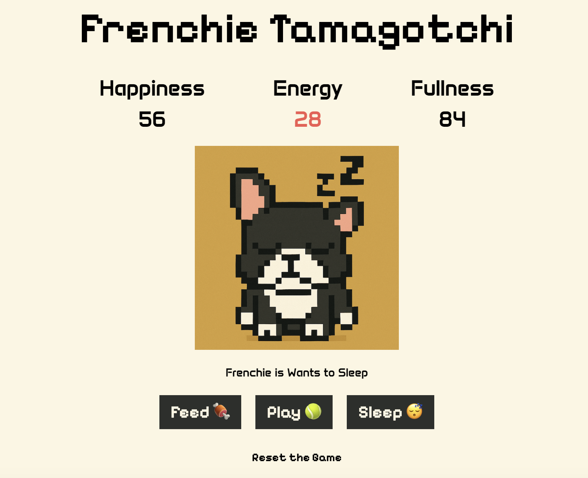

# 🐶 Frenchie Tamagotchi

A simple and cute virtual pet game built with React!  
Take care of your French Bulldog by feeding, playing, letting it sleep & rubbing his ears.  
But be careful — if you neglect the pup, the game ends!

---

## ✨ Screenshots / LiveDemo

[LIVE DEMO](https://frenchie-tamagotchi-by-daria-aleshina.netlify.app/)



---

## ✨ Tech Stack

- ⚛️ **React**
- ⚡ **Vite**
- 🧠 **JavaScript**
- 🎨 **Tailwind CSS**
- 📻 **Netlify**

---

## ✨ Features

- 🐾 Animated French Bulldog with changing state & emotions.
- ⏳ Pet stats decrease over time (game is over when any stat reaches 0).
- 🍖 Buttons to feed, play, let sleep & rub his ears - stats increase.
- ⏩ Speed Mode Toggler - set how fast the game runs ("slow" by default).
- 🐶 Mini-Game Mode - keep Frenchie on screen while you work or browse (currently only available in Chrome, on slow mode & not in sync with main screen)

---

## ✨ Design

- 🖼️ AI Generated Assets: Pet static visuals generated with ChatGPT & animated with Hailuoai
- Ⓜ Google Fonts: Pixelify Sans, Anta
- ✅ Responsive with Tailwind

---

## ✨ React features

- 🔄 Context API + useReducer – Manage pet stats and other game logic
- ⏱️ useEffect + setInterval – Auto-decrease stats over time
- 🛑 Effect cleanup – Stop interval when the game ends
- 🎛️ Conditional rendering – Change the pet image based on state
- 🚫 Button disabling – Disable actions when the game is over

---

## ✨ Mini-Game Mode in Chrome

The game includes a floating Picture-in-Picture (PiP) feature using Chrome’s **Document Picture-in-Picture API**. When you click the "Open Mini-Game" button, a small, always-on-top window opens within Chrome, running a mini version of the game.

This feature currently available only in Chrome 116+. Not available in other browsers.

---

## ✨ Getting Started

```bash
git clone https://github.com/DariaAleshina/frenchie-tamagotchi
cd frenchie-tamagotchi
npm install
npm run dev
```
